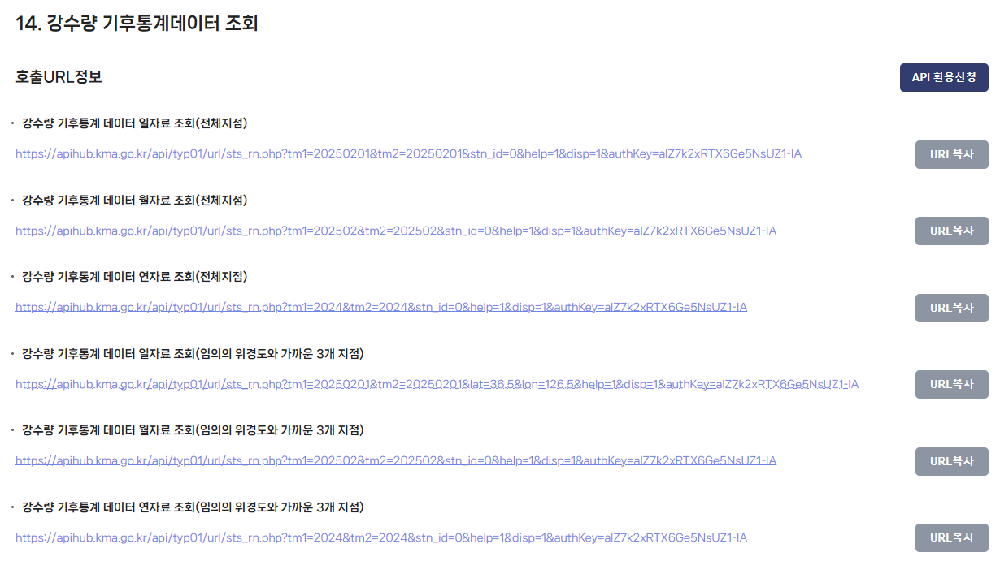
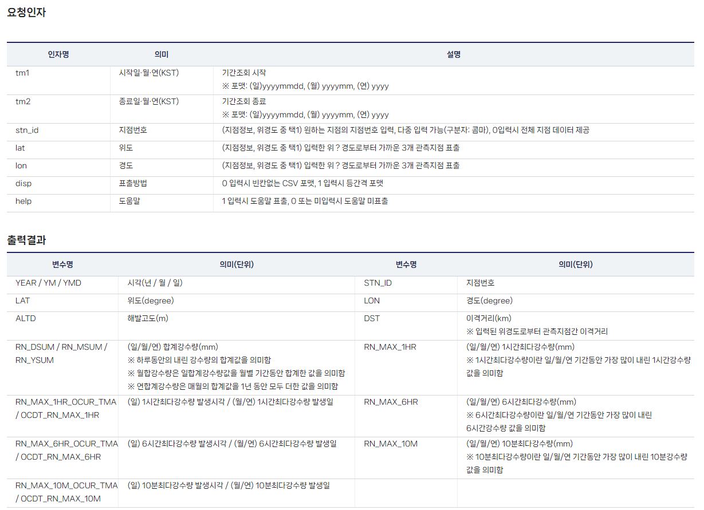

# 강수량 기후통계데이터를 이용한 하천범람 예측
## 분석할 내용
- 하천설계기준 및 하천범람기록에 대한 데이터를 조사하여 강수량 통계와의 연관성을 분석한다.
- 현재 일기예보에 기입된 시간당 강수량 및 현재 시기(계절, 월 등)에 대해 일일 총 강수량을 예측하고, 이를 이용하여 주변 하천범람가능성을 예측한다.

## 사용할 데이터
### 강수량 기후통계데이터(기상청 API)
- API를 이용하여 특정 지역의 일/월/연도 별 강수기록을 분석한다.
- 분석 내용을 토대로 주변 하천의 제방의 높이, 평시 수면높이 등을 조사하여 하천범람 가능성을 분석할 예정이다.

  
  
- RN_DSUM: 일합계강수량(mm)
- RN_MAX_10M: 10분최다강수량(mm)  
(10분최다강수량이란 하루동안의 가장 많이 내린 10분강수량 값을 의미)
- RN_MAX_1HR: 1시간최다강수량(mm)
- RN_MAX_6HR: 6시간최다강수량(mm)
- 출처: [https://apihub.kma.go.kr/](https://apihub.kma.go.kr/)  
(출처가 동적 페이지로 되어 있어, 지상관측>기후통계 경로의 '14. 강수량 기후통계데이터 조회'API를 이용함을 밝힙니다.)

### 하천설계기준
- 국토교통부에서 배포한 자료는 해당 깃허브의 data 폴더에 있습니다.  
출처: [https://www.molit.go.kr/USR/I0204/m_45/dtl.jsp?gubun=&search=&search_dept_id=&search_dept_nm=&old_search_dept_nm=&psize=10&search_regdate_s=&search_regdate_e=&srch_usr_nm=&srch_usr_num=&srch_usr_year=&srch_usr_titl=&srch_usr_ctnt=&lcmspage=1&idx=15899](https://www.molit.go.kr/USR/I0204/m_45/dtl.jsp?gubun=&search=&search_dept_id=&search_dept_nm=&old_search_dept_nm=&psize=10&search_regdate_s=&search_regdate_e=&srch_usr_nm=&srch_usr_num=&srch_usr_year=&srch_usr_titl=&srch_usr_ctnt=&lcmspage=1&idx=15899)
- 자료가 다소 많으므로, 자세한 내용은 조사예정

### 기타 수집예정 자료
- 하천에 대한 자료(csv, API 등)
- 기존의 하천범람에 대한 기록(csv)

### 기타
#### 호우피해 이력기록
[https://bd.kma.go.kr/kma2020/fs/preventionSelect1.do?pageNum=5&menuCd=F050401000#](https://bd.kma.go.kr/kma2020/fs/preventionSelect1.do?pageNum=5&menuCd=F050401000#)
- 이 내용도 활용을 고려하였으나, 해당 내용은 2016년 이후 업데이트가 되지 않았다.

## 프로젝트 범위
- API 및 csv를 이용한 데이터 수집 및 가공
- 판다스 라이브러리를 이용하여 통계데이터 분석
- matplot 라이브러리를 이용한 데이터 시각화
- 머신러닝/딥러닝을 이용한 일일 총 강수량 예측 및 하천 범랑가능성 예측

## 생성형 AI 결과

### 질문
(해당 깃허브의 위 내용 복사)
컴퓨터공학 대학생이 수강하는 빅데이터 수업에서 진행하는 프로젝트의 기획이야. 이걸 보고 너가 느낀 해당 기획의 장단점 및 개선사항을 알려 줘.

### 답변
좋은 기획서네요 👍 빅데이터 수업 프로젝트로 충분히 도전적이고, 실용성도 높은 주제예요. 제가 느낀 **장점, 단점(한계), 개선사항**을 정리해 드릴게요.

---

#### ✅ 장점

1. **실생활 밀접성**

   * 단순히 통계 분석에 그치지 않고, 하천범람이라는 사회적/환경적 문제 해결과 연결시켜 의미 있는 프로젝트로 발전 가능.
2. **다양한 데이터 활용**

   * 기상청 API(강수량) + 국토부 자료(하천설계기준) + 하천범람 기록 등 여러 데이터 소스를 결합 → 빅데이터 수업 취지에 맞음.
3. **데이터 분석 + 머신러닝/딥러닝**

   * 단순 시각화에 머물지 않고 예측 모델을 포함시켜 프로젝트 완성도를 높임.
4. **명확한 범위 제시**

   * 데이터 수집 → 가공 → 분석 → 시각화 → 예측까지 단계적으로 계획되어 있어 방향성이 뚜렷함.

---

#### ⚠️ 단점 / 한계

1. **데이터 가용성 불확실**

   * 하천범람 기록이나 하천별 수위·제방 높이 등의 데이터는 공개 자료가 제한적일 수 있음 → 데이터 부족 시 분석 한계.
2. **범위가 다소 넓음**

   * 강수량 예측 + 하천범람 가능성 예측 두 가지 목표를 동시에 잡음 → 학기 프로젝트 기준으로는 벅찰 수 있음.
3. **모델 구축 난이도**

   * 일일 강수량 예측은 시계열 분석(ARIMA, LSTM 등)이 필요하고, 하천범람 예측은 추가적인 지형·수문 데이터가 필요 → 과제 기간 내 구현이 어려울 수 있음.
4. **범람 가능성 평가 지표 미정**

   * "범람 가능성"을 어떻게 수치화/정량화할지 구체적 정의가 없음. (예: 특정 시간당 강수량이 제방 기준을 넘으면 위험으로 판단?)

---

#### 🔧 개선사항

1. **범위 축소/단계적 목표 설정**

   * 1단계: 강수량 기후통계 분석 및 예측 (시계열 모델 위주)
   * 2단계: 예측된 강수량을 기준으로 범람 위험도 단순 분류(안전/주의/위험)
   * 이렇게 나누면 학기 프로젝트로 현실적이고 달성 가능.
2. **데이터 대체 방안 마련**

   * 하천별 데이터가 부족하면 "사례 지역(예: 한강, 낙동강 등 대형 하천)"만 한정하여 분석.
   * 하천범람 기록이 부족하다면, 기상청 과거 태풍/호우 피해 통계 활용 가능.
3. **지표 정의 명확화**

   * 범람 가능성을 예측할 때,

     * “강수량 vs 제방 높이”의 임계치 비교
     * 또는 “기상청 호우주의보/경보 기준” 활용
   * 이런 기준을 명확히 잡으면 모델 결과 해석이 쉬워짐.
4. **시각화 강화**

   * 단순 그래프 외에 지도 기반 시각화(예: 지역별 위험도 히트맵) 적용하면 발표 시 임팩트가 큼.
5. **머신러닝 대신 간단한 통계 모델 우선 고려**

   * 딥러닝까지 가기엔 데이터 확보 및 튜닝 난이도가 높음 → 일단 회귀분석, Random Forest, ARIMA 같은 비교적 단순 모델부터 시도 후 확장.

---

👉 정리하면, 기획 자체는 **빅데이터 수업에서 매우 적합한 주제**예요. 다만 범위가 다소 넓으므로, **강수량 예측 → 범람 위험도 분류** 정도로 좁히고, **데이터 가용성을 미리 체크**하는 게 핵심이에요.

원해? 제가 이 기획을 실제 **학기말 발표용 목차(문서 구조)** 형태로도 잡아드릴까요?
