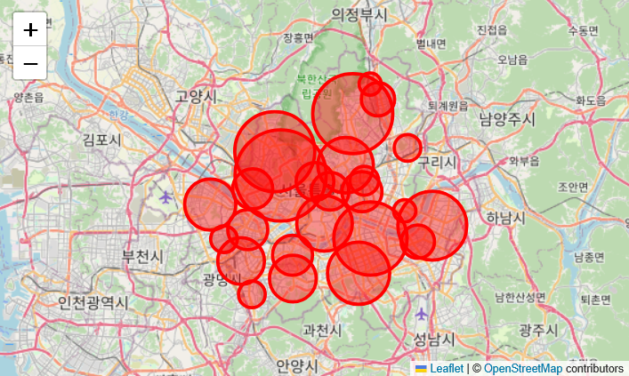
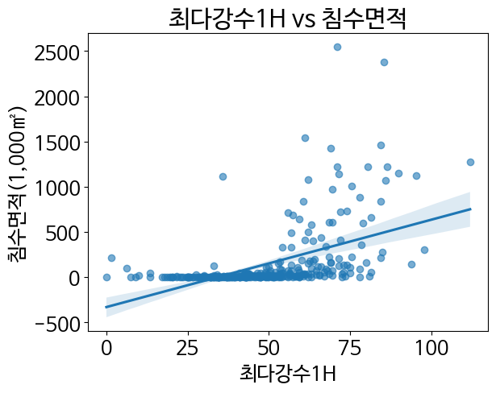
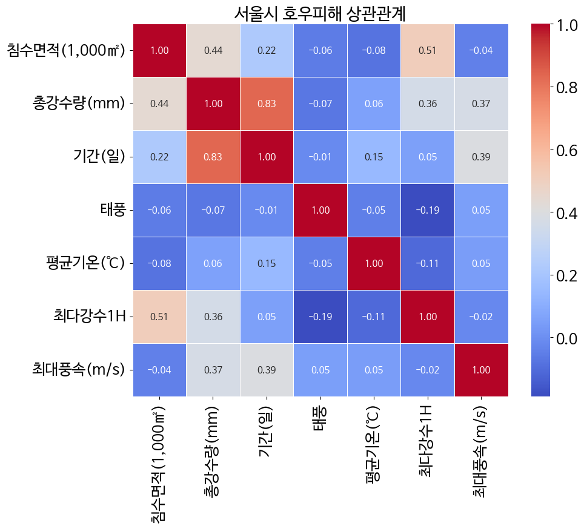

# 서울시 침수피해 데이터 분석 및 예측

## 1. 기획

### 프로젝트 배경
초기 기획 단계에서는 강수량 기후통계데이터와 하천설계기준을 활용하여  
**하천 범람 가능성 예측**을 목표로 하였다.  

이를 위해 기상청에서 제공하는 **호우피해 이력기록 데이터**의 활용을 검토하였으나,
해당 데이터는 **하천 범람 데이터를 수집**하는 것에 어려움이 있어 한계가 있었다.

이에 따라 본 프로젝트에서는 **하천범람이 아닌, 침수라는 좀 더 범용성 있는 데이터**를 활용하여  
분석 대상을 **하천 범람 → 도시 침수 피해**로 전환하였다.

### 최종 목표
- 서울시 침수피해 이력 데이터를 기반으로
- 강수량 및 기상 요소와 침수면적 간의 관계를 분석하고
- 머신러닝 및 딥러닝 모델을 활용하여 **침수면적(1,000㎡)을 예측**한다.

---

## 2. [데이터 전처리](호우피해_데이터전처리.ipynb)
### 2.1 원본 데이터 구조
- 컬럼 설명
- 데이터 예시

### 2.2 데이터 타입 정제
#### 2.2.1 일자 컬럼 datetime 변환
```py
df['일자'] = pd.to_datetime(df['일자'], format='%Y-%m-%d')
````

### 2.3 범주형 데이터 인코딩

#### 2.3.1 태풍 컬럼 이진 인코딩

* 값 종류 확인
* 레이블 인코딩 방식

```py
df['태풍'] = df['태풍'].apply(lambda x: 0 if x == '없음' else 1).astype(np.int64)
```

### 2.4 분석 대상 컬럼 정리

#### 2.4.1 행정구역 병합을 위한 컬럼 제거

* 일강수량(mm)
* 누적 강수량(mm)-2일
* 누적 강수량(mm)-3일
* 강수계속시간(시간)

#### 2.4.2 피해액 컬럼 제거

* 피해면적과의 중복성
* 분석 변수 과다 문제

### 2.5 침수 이벤트 단위 재구성

#### 2.5.1 연속 강우 침수 사례 정의

* 연속된 날짜를 하나의 침수 이벤트로 처리

#### 2.5.2 중간 날짜 선정 방식

```py
def get_middle_date(date_list):
    '''
    연속된 침수피해 날짜 중, 중간이 되는 날짜를 반환하는 함수
    '''
    if len(date_list) == 1:
        return date_list[0]
    sorted_dates = sorted(date_list)
    mid_idx = len(sorted_dates) // 2
    return sorted_dates[mid_idx]
```

#### 2.5.3 침수 이벤트 기준 그룹화 및 집계

* 그룹 기준 정의
* 수치형 컬럼 집계 방식

## 2.6 행정구역별 데이터 병합

서울시 침수 피해 데이터는 강서구, 강남구 등 **행정구역별로 개별 Excel 파일**로 분리되어 제공된다.  
이를 침수 예측 모델 학습에 활용하기 위해, 각 행정구역 데이터를 동일한 전처리 절차로 정제한 후 하나의 DataFrame으로 통합하였다.

#### 2.6.1 파일 단위 DataFrame 생성

각 행정구역 Excel 파일을 하나씩 불러와 전처리 및 침수 이벤트 단위로 재구성하기 위해 `Seolsi` 클래스를 정의하였다.  
이 클래스는 다음과 같은 역할을 수행한다.

- 행정구역별 Excel 파일 로드
- 분석에 불필요한 컬럼 제거
- 태풍 컬럼 이진 인코딩
- 날짜 컬럼(datetime) 변환
- 연속된 침수 사례를 하나의 이벤트로 그룹화
- 침수 이벤트별 통계값 집계
- 행정구역 이름 컬럼 추가

```py
dfs.append(Seolsi(full_path))
````

각 파일은 동일한 구조의 DataFrame으로 변환되며,
`행정구역` 컬럼을 통해 데이터의 출처를 구분할 수 있도록 구성하였다.

#### 2.6.2 서울시 단위 통합 DataFrame 구성

모든 행정구역별 DataFrame을 리스트에 저장한 후,
`pd.concat()`을 이용하여 서울시 전체 침수 피해 데이터를 하나의 DataFrame으로 병합하였다.

```py
df = pd.concat(df_li, ignore_index=True)
```

이 과정을 통해 행정구역 단위의 침수 데이터를
서울시 전체 관점에서 분석 및 예측할 수 있는 통합 데이터셋을 구축하였다.

---

### 2.7 데이터 정규화 및 정리

행정구역별 데이터를 병합하는 과정에서 발생한 데이터 형식 불일치와
분석에 불필요한 튜플을 제거하여 데이터의 일관성과 품질을 확보하였다.

#### 2.7.1 소수점 자리수 통일

여러 행정구역의 데이터를 집계하면서 평균 연산이 적용된 컬럼에서
불필요하게 긴 소수점 값이 생성되었다.
분석 및 시각화의 가독성을 높이기 위해 소수점 첫째 자리까지 반올림하였다.

```py
df['평균기온(℃)'] = df['평균기온(℃)'].astype(float).round(1)
df['태풍'] = df['태풍'].astype(float).round(1)
```

이를 통해 모든 수치형 컬럼의 표현 형식을 통일하고,
모델 학습 시 불필요한 노이즈를 최소화하였다.

---

다음으로 자연스럽게 이어질 부분은 보통:

- **2.7.2 침수면적 0 데이터 제거**
- **2.7.3 결측치(NaN) 처리**
- **3. 데이터 분석 및 시각화**


```py
df['평균기온(℃)'] = df['평균기온(℃)'].astype(float).round(1)
df['태풍'] = df['태풍'].astype(float).round(1)
```

#### 2.7.2 침수면적 0 제거

```py
df = df[df['침수면적(1,000㎡)'] != 0]
```

#### 2.7.3 결측치 처리

```py
df = df.dropna(how='any')
```


---

## 3. [분석 및 시각화](호우피해_데이터분석_시각화.ipynb)

### 기초 통계 분석

* 강수량, 강수 지속 기간, 시간당 최대 강수량이
  침수면적 증가와 밀접한 관련이 있음을 확인
* 일부 변수는 분산이 크고 이상치가 존재함을 확인

### 시각화 예시
* 침수면적 분포


* 강수량과 침수면적 간의 관계


* 변수 간 상관관계 히트맵


---

## 4. [예측 모델링](호우피해_예측.ipynb)

### 문제 정의

* **회귀(Regression) 문제**
* 입력 변수: 강수 및 기상 관련 변수
* 출력 변수: 침수면적(1,000㎡)

### 딥러닝 모델 구성

* Keras 기반 다층 퍼셉트론(MLP)
* 과적합 방지를 위해 Dropout 및 EarlyStopping 적용
* 검증 데이터 기반 성능 모니터링

```py
from tensorflow.keras.models import Sequential
from tensorflow.keras.layers import Dense, Dropout

model = Sequential()
model.add(Dense(64, activation='relu', input_dim=X_train.shape[1]))
model.add(Dropout(0.2))
model.add(Dense(32, activation='relu'))
model.add(Dense(1))

model.compile(optimizer='adam', loss='mse')
```

### 학습 전략

* Train / Validation / Test 데이터 분리 (랜덤)
* EarlyStopping을 통한 최적 Epoch 선택
* 하이퍼파라미터(은닉층 크기, Dropout 비율, 학습률) 반복 탐색

### 성능 평가 지표

* MAE
* RMSE
* R² Score

```py
from sklearn.metrics import mean_absolute_error, mean_squared_error, r2_score

mae = mean_absolute_error(y_test, y_pred)
rmse = np.sqrt(mean_squared_error(y_test, y_pred))
r2 = r2_score(y_test, y_pred)
```

### 결과

* 침수피해는 단기간 동안의 최대 강수량과 총 강수량을 이용하게 되면 정확성 높은 예측이 가능
* 제한된 데이터 수(318개)에도 불구하고
  강수 관련 변수들이 침수면적 예측에 유의미한 영향을 미침을 확인
* 데이터 수가 적은 상황에서 딥러닝의 한계 또한 확인할 수 있었으며,
  향후 데이터 확장 시 성능 개선 가능성이 큼

---

## 향후 개선 방향

* 더 많은 지역 및 연도의 침수피해 데이터 확보
* 시계열 모델(LSTM) 적용 가능성 검토
* 머신러닝 모델(RandomForest, XGBoost)과의 성능 비교
* 침수 발생 여부 분류(Classification) 문제로 확장